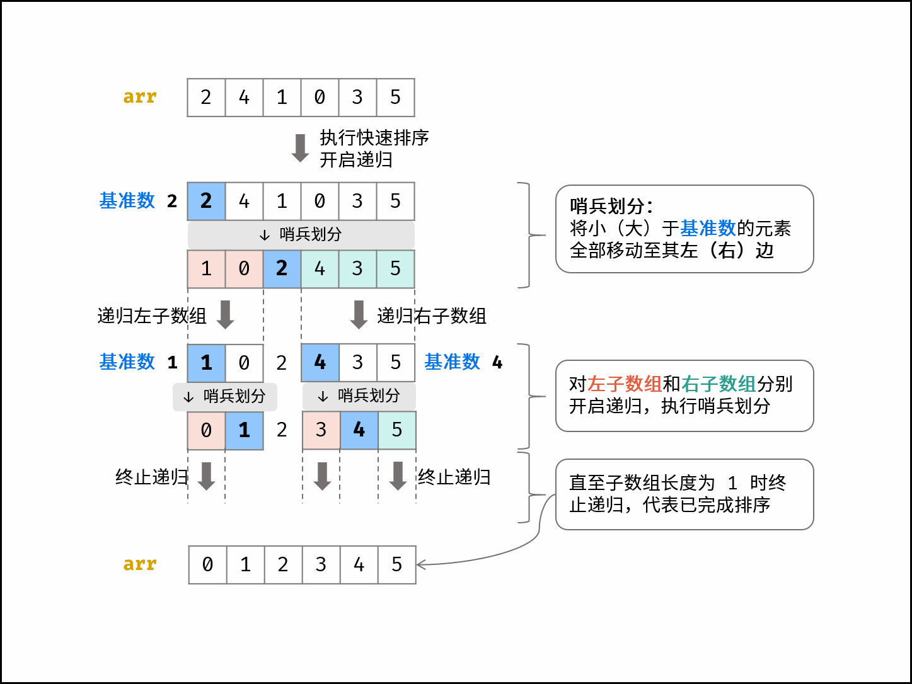

- # 算法解析
	- 快速排序有两个核心点，分别为**哨兵划分** 和 **递归** 。
	- ## 哨兵划分
		- 以数组某个元素（一般选取首个元素）为 **基准数**，将所有小于基准数的元素移动至其左边，大于基准树的元素已移动至其右边。
		-
	- ## 递归
		- 对 **左子树组** 和 **右子树组** 分别递归执行 **哨兵划分**，直至子数组长度为 1 时终止递归，即可完成对整个树组的排序。
		- > 如下图所示，为示例数组 [2,4,1,0,3,5] 的快速排序流程。观察发现，快速排序和 二分法 的原理类似，都是以 \log 时间复杂度实现搜索区间缩小。
		- 
- # 实现
	- ```js
	  function partition(nums, l, r) {
	    var i = l,
	      j = r;
	    var tmp;
	    while (i < j) {
	      while (i < j && nums[j] >= nums[l]) j--;
	      while (i < j && nums[i] <= nums[l]) i++;
	      tmp = nums[i];
	      nums[i] = nums[j];
	      nums[j] = tmp;
	    }
	    tmp = nums[i];
	    nums[i] = nums[l];
	    nums[l] = tmp;
	    return i;
	  }
	  
	  function quickSort(nums, l, r) {
	    // 子数组长度为 1 时终止递归
	    if (l >= r) return;
	    var i = partition(nums, l, r);
	    // 递归左（右）子数组执行哨兵划分
	    quickSort(nums, l, i - 1);
	    quickSort(nums, i + 1, r);
	  }
	  ```
- # 算法优化
	- 快速排序的常见优化手段有「Tail Call」和「随机基准数」两种。
	- Tail Call ：
	  由于普通快速排序每轮选取「子数组最左元素」作为「基准数」，因此在输入数组 完全倒序 时， partition() 的递归深度会达到 NN ，即 最差空间复杂度 为 O(N)O(N) 。
	- 每轮递归时，仅对 较短的子数组 执行哨兵划分 partition() ，就可将最差的递归深度控制在 O(\log N)O(logN) （每轮递归的子数组长度都 \leq≤ 当前数组长度 / 2/2 ），即实现最差空间复杂度 O(\log N)O(logN) 。
	- 代码仅需修改 quick_sort() 方法，其余方法不变，在此省略。
	- ```js
	  function quickSort(nums, l, r) {
	    // 子数组长度为 1 时终止递归
	    while (l < r) {
	      // 哨兵划分操作
	      var i = partition(nums, l, r);
	      // 仅递归至较短子数组，控制递归深度
	      if (i - l < r - i) {
	        quickSort(nums, l, i - 1);
	        l = i + 1;
	      } else {
	        quickSort(nums, i + 1, r);
	        r = i - 1;
	      }
	    }
	  }
	  ```
- 随机基准数：
	- 同样地，由于快速排序每轮选取「子数组最左元素」作为「基准数」，因此在输入数组 完全有序 或 完全倒序 时， partition() 每轮只划分一个元素，达到最差时间复杂度 O(N^2)
		- 因此，可使用 **随机函数** ，每轮在子数组中随机选择一个元素作为基准数，这样就可以极大概率避免以上劣化情况。
	- 值得注意的是，由于仍然可能出现最差情况，因此快速排序的最差时间复杂度仍为 O(N^2)
	- > 代码仅需修改 partition() 方法，其余方法不变，在此省略。
	- ```c++
	  int partition(vector<int>& nums, int l, int r) {
	      // 在闭区间 [l, r] 随机选取任意索引，并与 nums[l] 交换
	      int ra = l + rand() % (r - l + 1);
	      swap(nums[l], nums[ra]);
	      // 以 nums[l] 作为基准数
	      int i = l, j = r;
	      while (i < j) {
	          while (i < j && nums[j] >= nums[l]) j--;
	          while (i < j && nums[i] <= nums[l]) i++;
	          swap(nums[i], nums[j]);
	      }
	      swap(nums[i], nums[l]);
	      return i;
	  }
	  ```
-
- # JS版本
	- ```js
	  function quickSort(nums, l, r) {
	    if (l >= r) return
	    var i = partition(nums, l, r)
	    quickSort(nums, l, i - 1)
	    quickSort(nums, i + 1, r)
	  }
	  
	  function partition(nums, l, r) {
	    var i = l,
	      j = r
	    while (i < j) {
	      while (i < j && nums[j] > nums[l]) j--
	      while (i < j && nums[i] <= nums[l]) i++
	      swap(nums, i, j)
	    }
	    swap(nums, l, j)
	    return j
	  }
	  
	  function swap(nums, i, j) {
	    var tmp = nums[i]
	    nums[i] = nums[j]
	    nums[j] = tmp
	  }
	  var nums = [2, 4, 1, 0, 3, 6, 5]
	  quickSort(nums, 0, nums.length - 1)
	  console.log("nums", nums)
	  
	  ```