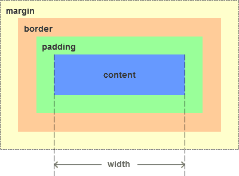

- ## 一、基本概念：标准模型+IE模型
	- **什么是盒模型：**盒模型又称框模型（Box Model）,包含了元素内容（content）、内边距（padding）、边框（border）、外边距（margin）几个要素。如图：
	- 
	- 由于IE盒模型的怪异模式，IE模型和标准模型的内容计算方式不同。
- ## 二、标准模型和IE模型的区别
	- IE模型和标准模型唯一的区别是内容计算方式的不同，如下图所示：
	- 
	- **IE模型元素宽度width=content+padding+border**，高度计算相同
	- 
	- **标准模型元素宽度width=content**，高度计算相同
- ## 三、css如何设置获取这两种模型的宽和高
	- 通过css3新增的属性 `box-sizing: content-box | border-box` 分别设置盒模型为标准模型（ `content-box` ）和IE模型（ `border-box` ）。
	- ```css
	  .content-box {
	    box-sizing:content-box;
	    width: 100px;
	    height: 50px;
	    padding: 10px;
	    border: 5px solid red;
	    margin: 15px;
	  }
	  ```
	- 
	- `.content-box` 设置为标准模型，它的元素宽度width=100px。
	- ```css
	  .border-box {
	    box-sizing: border-box;
	    width: 100px;
	    height: 50px;
	    padding: 10px;
	    border: 5px solid red;
	    margin: 15px;
	  }
	  ```
	- 
	- `.border-box` 设置为IE模型，它的元素宽度width=content + 2 padding + 2 border = 70px + 2 10px + 2 5px = 100px。
- ## 四、javascript如何设置获取盒模型对应的宽和高
	- 1. `dom.style.width/height` 只能取到行内样式的宽和高，style标签中和link外链的样式取不到。
	- 2. `dom.currentStyle.width/height` 取到的是最终渲染后的宽和高，只有IE支持此属性。
	- 3. `window.getComputedStyle(dom).width/height` 同（2）但是多浏览器支持，IE9以上支持。
	- 4. `dom.getBoundingClientRect().width/height` 也是得到渲染后的宽和高，大多浏览器支持。IE9以上支持，除此外还可以取到相对于视窗的上下左右的距离