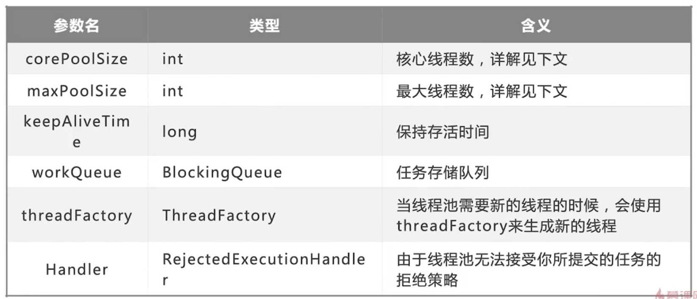
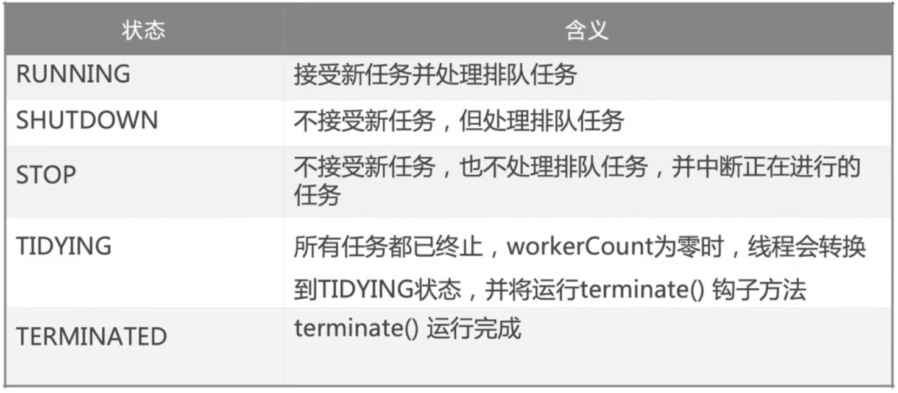

- 构造方法创建线程池
	- 线程池构造方法的参数
	  collapsed:: true
		- 
		- `corePoolSize`指的是核心线程数
			- 线程池再完成初始化后，默认情况下，线程池中并没有任何线程，线程池回等待又任务到来时，再创建新线程去执行任务
		- 最大量`maxPoolSize`
			- 在核心线程数的基础上，额外增加的线程数的上限
		- keepAliveTime
			- 如果线程池当前的线程数多于corePoolSize，那么如果多余的线程空闲时间超过keepAliveTime，他们就会被终止
		- 工作队列workQueue
			- 有3种最常见的队列类型
				- 直接交接：SynchronousQueue
				- 无界队列：LinkedBlockingQueue
				- 有界队列：ArrayBlockingQueue
		- ThreadFactory用来创建线程
			- 默认使用Excutors.defaultThreadFactory()
			- 创建出来的线程都在同一个线程组
			- 如果自己指定ThreadFactory，那么就可以改变线程名、线程组、优先级、是否是守护线程等
	- 添加线程规则 #.ol
	  collapsed:: true
		- 如果线程小于corePoolSize，创建一个新线程来运行新任务
		- 如果线程数等于（或大于）corePoolSize但少于maximumPoolSize，则将任务放入队列
		- 如果队列已满，并且线程数小于maxPoolSize，则创建一个新线程
		- 如果队列已满，并且线程数大于或等于maxPoolSize，则拒绝
	- 增减线程的特点 #.ol
	  collapsed:: true
		- 通过设置corePoolSize和maximumPoolSize相同，就可以创建固定大小的线程池
		- 线程池**希望保持较少的线程数**，并且只有在负载变得很大时才增加他
		- 通过设置maximumPoolSize为很高的值，可以允许线程池容纳任意数量的并发任务
		- 只有在队列填满时才创建多于corePoolSize的线程，如果使用的是无界队列，那么线程数就不会超过corePoolSize
- 线程池应该手动创建还是自动创建
	- `newFixedThreadPool`
		- 容易造成大量内容占用，可能会导致OOM
	- `newSingleThreadExecutor`
		- 当请求堆积的时候，可能会占用大量的内容
	- `CachedThreadPool`
		- 可缓存的线程池
			- ```java
			  ExecutorService executorService = Executors.newCachedThreadPool();
			  for (int i = 0; i < 1000; i++) {
			    executorService.execute(new Task());
			  }
			  ```
			- 弊端在于第二个参数maximumPoolSize被设置为了Integer.MAX_VALUE,这可能会创建数量非常多的线程，甚至导致OOM
	- `newScheduledThreadPool`
		- 支持定时及周期性任务执行的线程池
			- ```java
			          ScheduledExecutorService threadPool = Executors.newScheduledThreadPool(10);
			          // 延迟5秒
			          // threadPool.schedule(new Task(), 5, TimeUnit.SECONDS);
			          // 一开始延迟1秒，后面延迟3秒
			          threadPool.scheduleAtFixedRate(new Task(), 1, 3, TimeUnit.SECONDS);
			  ```
	- workStealingPool是JDK1.8加入的
		- 这个线程池和之前的有很大不同
		- 子任务
		- 窃取
	- 手动创建
		- 合适数量
			- CPU密集型（加密，计算hash等）：最佳线程数为CPU核心数的1-2倍左右
			- 耗时IO型（读写数据库、文件、网络读写等）：最佳线程数一般会大于CPU核心数很多倍
			- Brain Goetz推荐的计算方法：
				- `线程数=CPU核心数*（1+平均等待时间/平均工作时间）`
- 停止线程池
	- `shutdown`非暴力停止
		- ```java
		  ExecutorService executorService = Executors.newFixedThreadPool(10);
		  for (int i = 0; i < 1000; i++) {
		    executorService.execute(new ShutDownTask());
		  }
		  Thread.sleep(1500);
		  executorService.shutdown();
		  // executorService.execute(new ShutDownTask()); // 提交任务会报错
		  ```
	- `isShutdown` 是否开始停止
	- `isTerminated` 是否完全终止
	- `awaitTermination` 检测任务是否已经执行完了，不管是否已经执行了shutdown
	- `shutdownNow` 暴力停止，不管是否有任务，并返回未执行的任务列表
- 拒绝任务
	- 拒绝时机 #.ol
		- 当Executor关闭时，提交新任务会被拒绝
		- 以及当Executor对最大线程和工作队列容量实用有限边界并且已经饱和时
	- 拒绝策略
		- AbortPolicy
		- DiscardPolicy
		- DiscardOldestPolicy
		- CallerRunsPolicy
- 钩子方法
	- 每个任务执行前后
	- 日志、统计
	- ```java
	  public class PauseableThreadPool extends ThreadPoolExecutor {
	      private boolean isPaused;
	      private final ReentrantLock lock = new ReentrantLock();
	      private Condition unpaused = lock.newCondition();
	  
	  
	      @Override
	      protected void beforeExecute(Thread t, Runnable r) {
	          super.beforeExecute(t, r);
	          lock.lock();
	          try {
	              while (isPaused) {
	                  unpaused.await();
	              }
	          } catch (InterruptedException e) {
	              e.printStackTrace();
	          } finally {
	              lock.unlock();
	          }
	      }
	  
	      private void pause() {
	          lock.lock();
	          try {
	              isPaused = true;
	          } finally {
	              lock.unlock();
	          }
	      }
	  
	      public void resume() {
	          lock.lock();
	          try {
	              isPaused = false;
	              unpaused.signalAll();
	          } finally {
	              lock.unlock();
	          }
	      }
	  
	      public static void main(String[] args) throws InterruptedException {
	          PauseableThreadPool pauseableThreadPool = new PauseableThreadPool(10, 20, 10l, TimeUnit.SECONDS, new LinkedBlockingDeque<>());
	          Runnable runnable = new Runnable() {
	              @Override
	              public void run() {
	                  System.out.println("我被执行");
	                  try {
	                      Thread.sleep(10);
	                  } catch (InterruptedException e) {
	                      e.printStackTrace();
	                  }
	              }
	          };
	          for (int i = 0; i < 10000; i++) {
	              pauseableThreadPool.execute(runnable);
	          }
	          Thread.sleep(1500);
	          pauseableThreadPool.pause();
	          System.out.println("线程池被暂停了");
	          Thread.sleep(1000);
	          pauseableThreadPool.resume();
	          System.out.println("恢复了");
	      }
	  }
	  
	  ```
- 线程池状态
	- 
	-