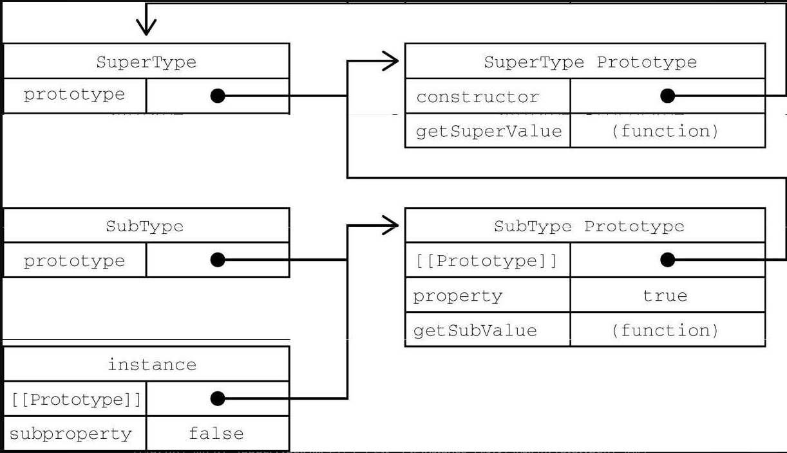

- ## 1. 原型链继承
	- 基本思想
		- 通过原型继承多个引用类型的属性和方法
	- 实现
		- ```js
		  function SuperType() {
		    this.property = true
		  }
		  SuperType.prototype.getSuperValue = function() {
		    return this.property
		  }
		  function SubType() {
		    this.subproperty = false
		  }
		  // 继承SuperType
		  SubType.prototype = new SuperType()
		  SubType.prototype.getSubValue = function() {
		    return this.subproperty
		  }
		  let instance = new SubType()
		  console.log(instance.getSuperValue()) // true
		  ```
	- 关系图
		- 
	- 问题 #.ol
		- 圆形中包含的引用值会在所有实例间共享
		- 子类型在实例化时不能给父类型的构造函数传参
		- 调用`instance.getSuperValue()`经过了3步搜索 #.ol
			- instance
			- SubType.prototype
			- SuperType.prototype
- ## 2. 盗用构造函数（对象伪装或经典继承）
	- 基本思想
		- 在子类构造函数中调用父类构造函数。因为比京函数就是在特定上下文中执行代码的简单对象，所以可以使用`apply()`和`call()`方法以新创建的对象为上下文执行构造函数。
	- 实现
		- ```js
		  function SuperType() {
		    this.colors = ["red", "blue", "green"]
		  }
		  function SubType() {
		    // 继承SuperType
		    SuperType.call(this)
		  }
		  
		  let instancel1 = new SubType()
		  instancel1.color.push("black")
		  console.log(instancel1.colors) 	// "red, blue, green, black"
		  let instancel2 = new SubType()
		  console.log(instancel2.colors)	// "red, blue, green"
		  ```
		- 传递参数：
		- ```js
		  function SuperType(name) {
		    this.name = name
		  }
		  function SubType() {
		    // 继承SuperType并传参
		    SuperType.call(this, "Nicholas")
		    // 实例属性
		    this.age = 29
		  }
		  
		  let instancel = new SubType()
		  console.log(instancel.name) 	// "Nicholas"
		  console.log(instancel.age) 		// 29
		  ```
	- 优点 #.ol
		- 避免了引用类型的属性被所有实例共享
		- 可以在`SubType`中向`SuperType`传参
	- 缺点： #.ol
		- 必须在构造函数中定义方法，因此函数不能重用，每次创建实例都会创建一遍方法
		- 子类也不能访问父类原型上定义的方法，因此所有类型只能使用构造函数模式
- ## 3. 组合继承（伪经典继承）
	- 基本思想
		- 综合了原型链和盗用构造函数，将两者的优点集中了起来。
		- 使用原型链继承原型上的属性和方法，而通过盗用构造函数继承实例方法。
		- 这样既可以把方法定义在原型上以实现重用，又可以让每个实例都有自己的属性
	- 实现
		- ```js
		  function SuperType(name) {
		    this.name = name
		    this.colors = ["red", "blue", "green"]
		  }
		  SuperType.prototype.sayName = function() {
		    console.log(this.name)
		  }
		  function SubType(name, age) {
		    SuperType.call(this, name)
		    this.age = age
		  }
		  SubType.prototype = new SuperType()
		  SubType.prototype.sayAge = function() {
		    console.log(this.age)
		  }
		  
		  let instance1 = new SubType("Nicholas", 29)
		  instance1.colors.push('black')
		  console.log(instance1.colors)  	// "red, blue, green, black"
		  instance1.sayName() 			// "Nicholas"
		  instance1.sayAge()				// 29
		  let instance2 = new SubType("Grag", 27)
		  console.log(instance2.colors) 	// "red, blue, green"
		  instance2.sayName() 			// "Grag"
		  instance2.sayAge()				// 27
		  ```
	- 优点：
		- 融合原型链继承和构造函数的优点，是 JavaScript 中最常用的继承模式。
		- 保留了`instanceof`和`isPrototypeOf()`方法识别合成对象的能力
	- 缺点：
		- 组合继承最大的缺点是会调用两个父构造函数
			- ```js
			  SubType.prototype = new SuperType() // 第一次调用构造函数
			  var child1 = new SubType("Grag", '18')  // 第二次调用构造函数
			  ```
- ## 4. 原型式继承
	- 基本思想
		- 不涉及严格意义上的构造函数的继承方法
		- 出发点是即使不自定义类型也可以通过原型视线对象之间的信息共享
	- 实现
		- ```js
		  function object(o) {	
		    function F() {}
		    F.prototype = o
		    return new F()
		  }
		  ```
		- 就是 ES5 [[Object.create]] 的模拟实现，将传入的对象作为创建的对象的原型。
	- 缺点：
		- 属性中包含引用值始终会在相关对象间共享，这点跟原型链继承一样。
- ## 5. 寄生式继承
	- 基本思想
		- 类似于寄生构造函数和工厂模式：创建一个实现继承的函数，以某种方式增强对象，然后返回这个对象
	- 实现
		- ```js
		  function createAnother(original) {
		    var clone = object(original)	// 通过调用函数创建一个新对象
		    clone.sayHi = function() {	// 以某种方式增强这个对象
		      console.log('hi')
		    }
		    return clone 					// 返回这个对象
		  }
		  
		  
		  let person = {
		    name: "Nicholas",
		    friends: ["Shelby", "Court", "Van"]
		  }
		  let anotherPerson = createAnother(person)
		  anotherPerson.sayHi()		// 'hi'
		  ```
		- > object()函数不是寄生式继承所必需的，任何返回新对象的函数都可以在这里使用。
	- 缺点：
		- 跟借用构造函数模式一样，每次创建对象都会创建一遍方法
		- > 通过寄生式继承给对象添加函数会导致函数难以重用，与构造函数模式类似
- # 6. 寄生组合式继承
	- 基本思想
		- 通过盗用构造函数即成属性，但使用混合式原型链即成方法
		- 不通过调用父类构造函数给子类原型赋值，而是取得父类原型的一个副本。
	- ```js
	  function inheritPrototype(subType, superType) {
	    let prototype = object(superType.prototype) 		// 创建对象
	    prototype.constructor = subType	// 增强对象
	    subType.prototype = prototype		// 赋值对象
	  }
	  ```
	- ```js
	  function SuperType(name) {
	    this.name = name;
	    this.colors = ["red", "blue", "green"]
	  }
	  SuperType.prototype.sayName = function() {
	    console.log(this.name)
	  }
	  function SubType(name, age) {
	    SuperType.call(this, name)
	    this.age = age
	  }
	  inheritPrototype(SubType, SuperType)
	  SubType.prototype.sayAge = function() {
	    console.log(this.age)
	  }
	  
	  
	  let sub = new SubType("zhangsan", 22)
	  sub.sayName() 		// zhangsan
	  sub.sayAge()		// 22
	  ```
	- 优点：
		- 解决父类构造函数始终会被调用两次问题；
		- 这种方式的高效率体现它只调用了一次 `Parent` 构造函数，并且因此避免了在 `Parent.prototype` 上面创建不必要的、多余的属性。与此同时，原型链还能保持不变；因此，还能够正常使用 `instanceof` 和`isPrototypeOf` 。开发人员普遍认为寄生组合式继承是引用类型最理想的继承范式。
-