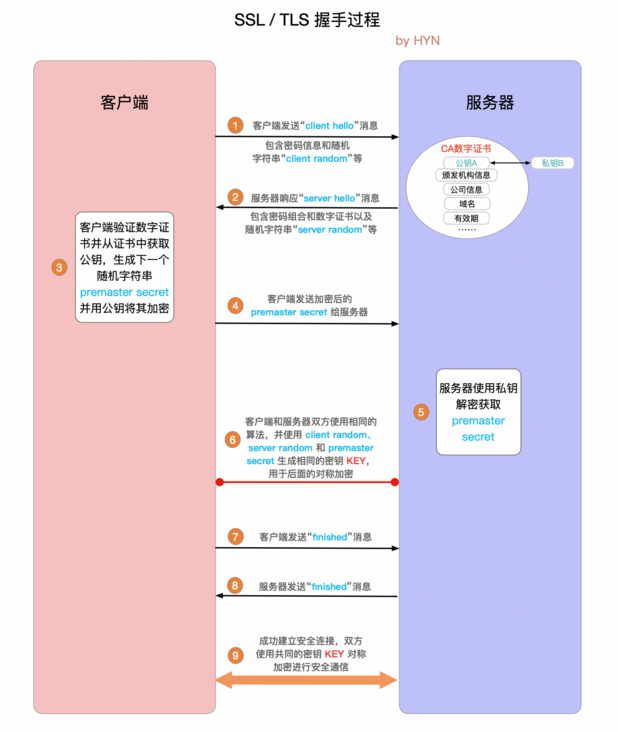

- [[七层网络模型]]
- [[HTTP]]
	- [[HTTP/2]]
	- [[HTTPS]]
	  collapsed:: true
		- 
	- [[HTTP缓存]]
	- [[HTTP Cookie]]
	- 安全
		- [[会话劫持和XSS]]
		- [[跨站请求伪造(CSRF)]]
		- [[跨源资源共享(CORS)]]
			- 解决跨域方案
				- [[通过jsonp]]
				- [[WebSocket]]
				- 跨域资源共享[[CORS]]
				- [[Node接口代理]]
				- [[Nginx代理]]
				- [[postMessage]]
				- [[document.domain + iframe]]
				- `location.hash` + `iframe`
				- `window.name` + iframe
				-
				-
				-
	- 参考
		- [HTTP 的发展 - HTTP | MDN](https://developer.mozilla.org/zh-CN/docs/Web/HTTP/Basics_of_HTTP/Evolution_of_HTTP)
		- [HTTP 消息 - HTTP | MDN](https://developer.mozilla.org/zh-CN/docs/Web/HTTP/Messages#http2_%E5%B8%A7?)
		- [一文读懂 Web 安全 - SegmentFault 思否](https://segmentfault.com/a/1190000023396707)
- HTTPS