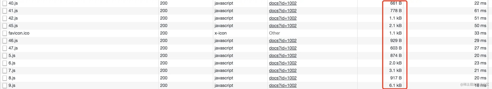

- 这个点只针对前后端分离的前端应用，优化效果看情况，有时候可能形成反效果。
- 面试的过程中，基本每个面试者我都必问，但没有答得特别好的。
- 路由懒加载和 1.4 资源合并 有一定的冲突性。
	- 1）资源合并一般针对不经常修改的第三方包，对于业务 JS 代码一般不做合并。
	- 2）路由懒加载是将页面的JS代码拆分成一个一个的 chunk 包，只有加载页面的时候再去加载 JS 资源。
	- 3）用户经常访问的页面，不要用路由懒加载，经常访问的页面主要是首页；对于用户经常访问的页面，因为用户肯定需要将页面的 chunk js 加载下来才可以访问页面，路由懒加载会导致先加载 资源清单 manifest 文件，再去加载页面的 chunk 包，这样就形成了一个资源的串行请求，本来可以一次加载下来却非得拆分成2次而且还是串行的不是并行的。
- 一个页面的 chunk 包其实不会很大，将它合进主 chunk 里也不会带来明显的请求耗时加大，反而请求次数多了带来的网络延迟消耗比较明显。
- 