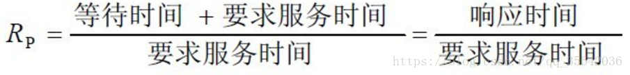

- 先来先服务调度算法
	- 先来先服务（FCFS）调度算法是一种最简单的调度算法，该算法即可用于作业调度，也可用于进程调度。当在作业调度中采用该算法时，每次调度都是从后备作业队列中选择一个或多个最先进入该队列的作业，将他们调入内存，将他们分配资源、创建进程，然后放入就绪队列。在进程调度中采用FCFS算法时，则每次调度时从就绪队列中选择一个最先进入该队列的进程，为之分配处理机，使之投入运行。该进程一直运行到完成或发生某事件而阻塞后才放弃处理机。
- 短作业（进程）优先调度算法
	- 短作业（进程）优先调度算法SJ(P)F，是指对短作业或短进程优先调度的算法。他们可以分别用于作业调度和进程调度。短作业优先（SJF）的调度算法是从后备队列中选择一个或若干个估计运行时间最短的作业，将他们调入内存运行。而短进程优先（SPF）调度算法则是从就绪队列中选出一个估计运行时间最短的进程，将处理机分配给它，使它立即执行并一直执行到完成，或发生某事件而被阻塞放弃处理机时再重新调度。
- 高优先权先调度算法
	- 为了照顾紧迫性作业，使之在进入系统后便获得优先处理，引入了最高优先权优先（FPF）调度算法。此算法常被用于批处理系统中，作为作业调度算法，也作为多种操作系统中进程调度算法，还可用于实时系统中。当把该算法用于作业调度时，系统将从后备队列中选择若干个优先权最高的作业装入内存。当用于进程调度时，该算法是把处理机分配给就绪队列中优先权最高的进程，这时，又可进一步把该算法分成如下两种：
		- 1. 非抢占式优先权算法：
			- 在这种方式下，系统一旦把处理机分配给就绪队列中优先权最高的进程后，该进程便一直执行下去，直至完成；或因发生某事件使该进程放弃处理机时，系统方可再将处理机重新分配给另一优先权最高的进程。这种调度算法主要用于批处理系统中；也可用于某些对实时性要求不严的实时系统中。
		- 2. 抢占式优先权调度算法：
			- 在这种方式下，系统同样时把处理机分配给优先权最高的进程，使之执行。但在其执行期间，只要又出现了另一个其优先权更高的进程，进程调度程序就立即停止当前进程（原优先权最高的进程）的执行，重新将处理机分配给新到的优先权最高的进程。因此，在采用这种调度算法时，是每当系统中出现一个新的就绪进程 i 时，就将其优先权 Pi 与正在执行的进程 j 的优先权 Pj 进行比较。如果 Pi ≤ Pj ，原进程Pj便继续执行；但如果时 Pi>Pj，则立即停止Pj的执行，做进程切换，使i进程投入执行。显然，这种抢占式的优先权调度算法能更好地满足紧迫作业的要求，故而常用于要求比较严格的实时系统中，以及对性能要求较高的批处理和分时系统中。
		- 3. 容易出现优先级倒置现象：
			- 优先级反转是指一个低优先级的任务持有一个被高优先级任务所需要的共享资源。高优先任务由于因资源缺乏而处于受阻状态，一直等到低优先级任务释放资源为止。而低优先级获得的CPU时间少，如果此时有优先级处于两者之间的任务，并且不需要那个共享资源，则该中优先级的任务反而超过这两个任务而获得CPU时间。如果高优先级等待资源时不是阻塞等待，而是忙循环，则可能永远无法获得资源，因此此时低优先级进程无法与高优先级进程抢夺CPU时间，从而无法执行，进而无法释放资源，造成的后果就是高优先级任务无法获得资源而继续推进。
		- 4. 优先级反转案例解释：
			- 不同优先级线程对共享资源的访问的同步机制。优先级为高和低的线程tall和线程low需要访问共享资源，优先级为中等的线程mid不访问该共享资源。当low正在访问共享资源时，tall等待该共享资源的互斥锁，但是此时low被mid抢先了，导致mid运行tall阻塞。即优先级低的线程mid运行，优先级高的tall被阻塞。
		- 5. 优先级倒置解决方案：
			- (3.5.1）设置优先级上限，给临界区一个高优先级，进入临界区的进程都将获得这个高优先级，如果其他试图进入临界区的进程的优先级都低于这个高优先级，那么优先级反转就不会发生。
			- （3.5.2）优先级继承，当一个高优先级进程等待一个低优先级进程持有的资源时，低优先级进程将暂时获得高优先级进程的优先级别，在释放共享资源后，低优先级进程回到原来的优先级别。嵌入式系统VxWorks就是采用这种策略。
			- （3.5.3）第三种方法就是临界区禁止中断，通过禁止中断来保护临界区，采用此种策略的系统只有两种优先级：可抢占优先级和中断禁止优先级。前者为一般进程运行时的优先级，后者为运行于临界区的优先级。火星探路者正是由于在临界区中运行的气象任务被中断发生的通信任务所抢占才导致故障，如果有临界区的禁止中断保护，此一问题也不会发生。
- 高响应比优先调度算法
	- 在批处理系统中，短作业优先算法是一种比较好的算法，其主要的不足之处是长作业的运行得不到保证。如果我们能为每个作业引入前面所述的动态优先权，并使作业的优先级随着等待时间的增加而以速率a提高，则长作业在等待一定的时间后，必然有机会分配到处理机。该优先权的变化规律可描述为：
	- 
	- 在利用该算法时，每要进行调度之前，都须先做响应比的计算，这会增加系统开销。
- 时间片轮转法
	- 在早期的时间片轮转法中，系统将所有的就绪进程按先来先服务的原则排成一个队列，每次调度时，把CPU分配给队首进程，并领其执行一个时间片。时间片的大小从几ms到几百ms。当执行的时间片用完时，由一个计时器发出时钟中断请求，调度程序便据此信号来停止该进程的执行，并将它送往就绪队列的末尾；然后，再把处理机分配给就绪队列中新的队首进程，同时也让它执行一个时间片。这样就可以保证就绪队列中的所有进程在一给定的时间内均获得一时间片的处理机执行时间。换言之，系统能在给定的时间内响应所有用户的请求。
- 多级反馈队列调度算法
	- 前面介绍的各种用作进程调度的算法都有一定的局限性。如短进程优先的调度算法，仅照顾了短进程而忽略了长进程，而且如果并未指明进程的长度，则短进程优先和基于进程长度的抢占式调度算法都将无法使用。而多级反馈队列调度算法则不必事先知道各种进程所需的执行时间，而且还可以满足各种类型进程的需要，因而它是目前被公认的一种较好的进程调度算法。在采用多级反馈队列调度算法的系统中，调度算法的实施过程如下所述：
		- 1. 应设置多个就绪队列，并为各个队列赋予不同的优先级。第一队列的优先级最高，第二个队列次之，其余各队列的优先权逐个降低。该算法赋予各个队列中进程执行时间片的大小也各不相同，在优先权愈高的队列中，为每个进程所规定的执行时间片就愈小。例如，第二个队列的时间片要比第一个队列的时间片长一倍，......，第i+1各队列的时间片要比第i个队列的时间片长一倍。
		  2. 当一个新程序进入内存后，首先将它放入第一队列的末尾，按FCFS原则排队等待调度。当轮到该进程执行时，如它能在该时间片内完成，便可准备撤离系统；如果它在一个时间片结束时尚未完成，调度程序便将进程转入第二队列的末尾，再同样的按FCFS原则等待调度执行；如果它再第二队列中运行一个时间片后仍未完成，再一次将它放入第三队列，......，如此下去，当一个长作业（进程）从第一队列一次降到第n队列后，在第n队列便采取按时间片轮转的方式运行。
		  3. 仅当第一队列空闲时，调度程序才调度第二队列中的进程运行；仅当第1 ~ (i - 1) 队列均空时，才会调度第i队列中的进程运行。如果处理机正在第i队列中为某进程服务时，又有新进程进入优先权较高的队列（第1 ~ (i-1)中的任何一个队列），则此时新进程将抢占正在运行进程的处理机，即由调度程序把正在运行的进程放回到第i队列的末尾，把处理机分配给新到的高优先权进程。
		- 
### **批处理系统、分时系统和实时系统中，各采用哪几种进程（作业）调度算法？**
	- 批处理系统常用调度算法：
	- ①、先来先服务：[FCFS](https://www.baidu.com/s?wd=FCFS&tn=SE_PcZhidaonwhc_ngpagmjz&rsv_dl=gh_pc_zhidao)
	- ②、最短作业优先
	- ③、最短剩余时间优先
	- ④、响应比最高者优先
	- 分时系统调度算法：
	- ①、轮转调度
	- ②、优先级调度
	- ③、多级队列调度
	- ④、彩票调度
	- 实时系统调度算法：
	- ①、单比率调度
	- ②、限期调度
	- ③、最少裕度法