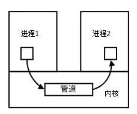

- ## 概念
	- 每个进程各自有不同的用户地址空间，任何一个进程的全局变量在另一个进程中都看不到，所以进程之间要交换数据必须通过内核，在内核开辟一块缓冲区，进程1把数据从用户空寂爱你拷到内核缓冲区，进程2再从内核缓冲区把数据读走，内核提供的这级中机制成为**进程间通信（IPC，InterProcess Communication)**
	- 
- ## 进程间通信的7种方式
	- ### 传统Unix通信机制
		- #### 1. 管道/匿名管道（[[pipe]]）
			- 特性：
			  collapsed:: true
				- 管道是半双工的，数据只能向一个方向流动；需要双方通信时，需要建立起两个管道；
				- 只能用于父子进程或者兄弟进程之间（具有亲缘关系的进程）；
				- 单独构成一种独立的文件系统：管道对于管道两端的进程而言，就是一个文件，但它不是普通的文件，它不属于某种文件系统，而是自立门户，单独构成一种文件系统，并且只存在与内存中；
				- 数据的读出和写入：一个进程向管道中写的内容被管道另一端进程读出。写入的内容每次都添加在管道缓冲区的末尾，并且每次都是从缓冲区的头部读出数据；
				- 
			- 实质：
			  collapsed:: true
				- 管道的实质是一个内核缓冲区，进程以先进先出的方式从缓冲区存取数据，管道一端的进程顺序的将数据写入缓冲区，另一端的进程则顺序的读出数据。
				- 该缓冲区可以看做是一个循环队列，读和写的位置都是自动增长的，不能随意改变，一个数据只能被读一次，读出来以后再缓冲区就不复存在了。
				- 当缓冲区读空或者写满时，有一定的规则控制相应的读进程或者写进程进入等待队列，当空的缓冲区有新数据写入或者满的缓冲区有数据读出来时，就唤醒等待队列中的进程继续读写。
			- 管道的局限：
			  collapsed:: true
				- 管道的主要局限性正体现在它的特点上：
					- 只支持单向数据流；
					- 只能用于具有亲缘关系的进程之间；
					- 没有名字；
					- 管道的缓冲区是有限的（管道只存于内存中，在管道创建时，为缓冲区分配一个页面大小）；
					- 管道所传送的是无格式字节流，这就要求管道的读出方式和写入方式必须事先约定好数据的格式，比如多少字节算作一个消息（或命令、或记录）等等；
		- #### 2. 有名管道（[[FIFO]]）
			- 匿名管道，由于没有名字，只能用于亲缘关系的进程间通信。为了客服这个缺点，提出了又名管道（FIFO）；
			- 有名管道不同于匿名管道之处在于它提供了一个路径名与之关联，**以有名管道的文件形式存在于文件系统中**，这样，**即使与有名管道的创建进程不存在亲缘关系的进程，只要可以访问该路径，就能够彼此通过有名管道相互通信**，因此，通过有名管道不想管的进程也能交换数据。值的注意的是，有名管道严格遵循**先进先出(first in first out)**,对匿名管道及有名管道的读总是从开始处返回数据，对它们的写则把数据添加到末尾。它们不支持诸如lseek()等文件定位操作。**有名管道的名字存在于文件系统中，内容存放在内存中。**
		- **匿名管道和有名管道总结：**
			- （1）管道是特殊类型的文件，在满足先入先出的原则条件下可以进行读写，但不能进行定位读写。
			  （2）匿名管道是单向的，只能在有亲缘关系的进程间通信；有名管道以磁盘文件的方式存在，可以实现本机任意两个进程通信。
			  （3）**无名管道阻塞问题：**无名管道无需显示打开，创建时直接返回文件描述符，在读写时需要确定对方的存在，否则将退出。如果当前进程向无名管道的一端写数据，必须确定另一端有某一进程。如果写入无名管道的数据超过其最大值，写操作将阻塞，如果管道中没有数据，读操作将阻塞，如果管道发现另一端断开，将自动退出。
			  （4）**有名管道阻塞问题：**有名管道在打开时需要确实对方的存在，否则将阻塞。即以读方式打开某管道，在此之前必须一个进程以写方式打开管道，否则阻塞。此外，可以以读写（O_RDWR）模式打开有名管道，即当前进程读，当前进程写，不会阻塞。
		- #### 3. 信号([[Signal]])
			- 信号是Linux系统中用于进程间互相通信或者操作的一种机制，信号可以在任何时候发给某一进程，而无需知道该进程的状态。
			- 如果该进程当前并未处于执行状态，则该信号就有内核保护起来，直到该进程回复执行并传递给它为止。
			- 如果一个信号被进程设置为阻塞，则该信号的传递被延迟，直到其阻塞被取消是才被传递给进程。
		- #### 4. [[消息队列]]
			- 特点：
				- 消息队列是存放在内核中的消息链表，每个消息队列由消息队列标识符表示
				- 与管道（ [[pipe]] ）不同的是消息队列存放在内核中，只有内核重启（即: 操作系统重启）或者显示地删除一个消息队列时，该消息队列才会被真正删除。
				- 另外与管道不同的是，消息队列在某个进程往一个队列写入消息之前，并不需要另外某个进程在该队列上等待消息的到达。
			- **消息队列特点总结：**
				- （1）消息队列是消息的链表,具有特定的格式,存放在内存中并由消息队列标识符标识.
				  （2）消息队列允许一个或多个进程向它写入与读取消息.
				  （3）管道和消息队列的通信数据都是先进先出的原则。
				  （4）消息队列可以实现消息的随机查询,消息不一定要以先进先出的次序读取,也可以按消息的类型读取.比FIFO更有优势。
				  （5）消息队列克服了信号承载信息量少，管道只能承载无格式字 节流以及缓冲区大小受限等缺。
				  （6）目前主要有两种类型的消息队列：POSIX消息队列以及System V消息队列，系统V消息队列目前被大量使用。系统V消息队列是随内核持续的，只有在内核重起或者人工删除时，该消息队列才会被删除。
		- #### 5. [[共享内存]]
			- 使得多个进程可以可以直接读写同一块内存空间，是最快的可用IPC形式。是针对其他通信机制运行效率较低而设计的。
			- 为了在多个进程间交换信息，内核专门留出了一块内存区，可以由需要访问的进程将其映射到自己的私有地址空间。进程就可以直接读写这一块内存而不需要进行数据的拷贝，从而大大提高效率。
			- 由于多个进程共享一段内存，因此需要依靠某种同步机制（如信号量）来达到进程间的同步及互斥。
		- #### 6. [[信号量]]
			- 信号量是一个计数器，用于多进程对共享数据的访问，信号量的意图在于进程间同步。
			  为了获得共享资源，进程需要执行下列操作：
			  （1）**创建一个信号量**：这要求调用者指定初始值，对于二值信号量来说，它通常是1，也可是0。
			  （2）**等待一个信号量**：该操作会测试这个信号量的值，如果小于0，就阻塞。也称为P操作。
			  （3）**挂出一个信号量**：该操作将信号量的值加1，也称为V操作。
			- 为了正确地实现信号量，信号量值的测试及减1操作应当是原子操作。为此，信号量通常是在内核中实现的。Linux环境中，有三种类型：**Posix（[可移植性操作系统接口](https://link.jianshu.com?t=http://baike.baidu.com/link?url=hYEo6ngm9MlqsQHT3h28baIDxEooeSPX6wr_FdGF-F8mf7wDp2xJWIDtQWGEDxthtPNiJtlsw460g1_N0txJYa)）有名信号量（使用Posix IPC名字标识）**、**[[Posix]]基于内存的信号量（存放在共享内存区中）**、**[[System V]]信号量（在内核中维护）**。这三种信号量都可用于进程间或线程间的同步。
		- #### 7. 套接字[[socket]]
			- 套接字是一种通信机制，凭借这种机制，客户/服务器（即要进行通信的进程）系统的开发工作既可以在本地单机上进行，也可以跨网络进行。也就是说它可以让不在同一台计算机但通过网络连接计算机上的进程进行通信。
			- 
			- 套接字是支持TCP/IP的网络通信的基本操作单元，可以看做是不同主机之间的进程进行双向通信的端点，简单的说就是通信的两方的一种约定，用套接字中的相关函数来完成通信过程。