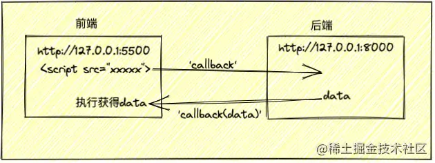

- 概述
	- 以下这三个标签 `加载资源路径` 是不受束缚的 #.ol
		- script标签： ``
		- link标签： `<link herf="加载资源路径"></link>`
		- img标签： `</img>`
	- 而JSONP就是利用了 `script` 的 `src` 加载不受束缚，从而可以拥有从 `不同的域` 拿到数据的能力，但是JSONP需要前端后端配合，才能实现最终的 `跨域获取数据` 。
	  JSONP通俗点说就是：利用script的src去发送请求，将一个方法名 `callback` 传给后端，后端拿到这个方法名，将所需数据，通过字符串拼接成新的字符串 `callback(所需数据)` ,并发送到前端，前端接受到这个字符串之后，就会自动执行方法 `callback(所需数据)` 。
	- 
	-