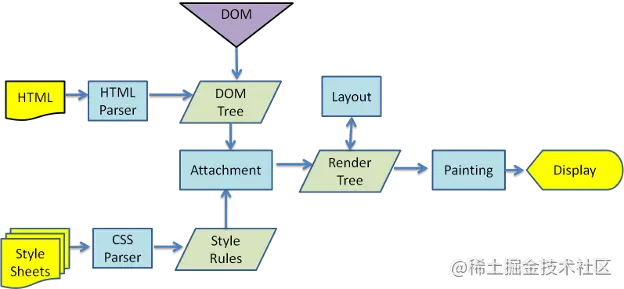

- # 浏览器渲染过程
	- 1. 解析HTML生成DOM树。
	- 2. 解析CSS生成CSSOM规则树。
	- 3. 解析JS，操作 DOM 树和 CSSOM 规则树。
	- 4. 将DOM树与CSSOM规则树合并在一起生成渲染树。
	- 5. 遍历渲染树开始布局，计算每个节点的位置大小信息。
	- 浏览器将所有图层的数据发送给GPU，GPU将图层合成并显示在屏幕上。
	  
- # 重排
	- 当改变 DOM 元素位置或大小时，会导致浏览器重新生成渲染树，这个过程叫重排。
- # 重绘
	- 当重新生成渲染树后，就要将渲染树每个节点绘制到屏幕，这个过程叫重绘。不是所有的动作都会导致重排，例如改变字体颜色，只会导致重绘。记住，重排会导致重绘，重绘不会导致重排 。
	- 重排和重绘这两个操作都是非常昂贵的，因为 JavaScript 引擎线程与 GUI 渲染线程是互斥，它们同时只能一个在工作。
	- 什么操作会导致重排？
		- 添加或删除可见的 DOM 元素
		- 元素位置改变
		- 元素尺寸改变
		- 内容改变
		- 浏览器窗口尺寸改变
	- 如何减少重排重绘？
		- 用 JavaScript 修改样式时，最好不要直接写样式，而是替换 class 来改变样式。
		- 如果要对 DOM 元素执行一系列操作，可以将 DOM 元素脱离文档流，修改完成后，再将它带回文档。推荐使用隐藏元素（display:none）或文档碎片（DocumentFragement），都能很好的实现这个方案。
	-