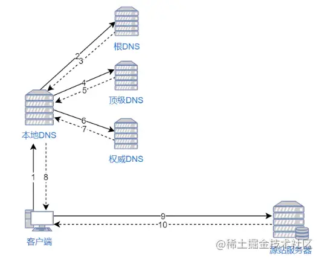
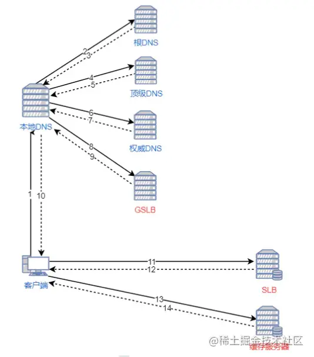

- 内容分发网络（CDN）是一组分布在多个不同地理位置的 Web 服务器。我们都知道，当服务器离用户越远时，延迟越高。CDN 就是为了解决这一问题，在多个位置部署服务器，让用户离服务器更近，从而缩短请求时间。
- ### CDN 原理
	- 当用户访问一个网站时，如果没有 CDN，过程是这样的：
		- 1. 浏览器要将域名解析为 IP 地址，所以需要向本地 DNS 发出请求。
		- 2. 本地 DNS 依次向根服务器、顶级域名服务器、权限服务器发出请求，得到网站服务器的 IP 地址。
		- 3. 本地 DNS 将 IP 地址发回给浏览器，浏览器向网站服务器 IP 地址发出请求并得到资源。
		- 
	- 如果用户访问的网站部署了 CDN，过程是这样的：
		- 1. 浏览器要将域名解析为 IP 地址，所以需要向本地 DNS 发出请求。
		  2. 本地 DNS 依次向根服务器、顶级域名服务器、权限服务器发出请求，得到全局负载均衡系统（GSLB）的 IP 地址。
		  3. 本地 DNS 再向 GSLB 发出请求，GSLB 的主要功能是根据本地 DNS 的 IP 地址判断用户的位置，筛选出距离用户较近的本地负载均衡系统（SLB），并将该 SLB 的 IP 地址作为结果返回给本地 DNS。
		  4. 本地 DNS 将 SLB 的 IP 地址发回给浏览器，浏览器向 SLB 发出请求。
		  5. SLB 根据浏览器请求的资源和地址，选出最优的缓存服务器发回给浏览器。
		- 6. 浏览器再根据 SLB 发回的地址重定向到缓存服务器。
		- 7. 如果缓存服务器有浏览器需要的资源，就将资源发回给浏览器。如果没有，就向源服务器请求资源，再发给浏览器并缓存在本地。
		- 
		- 参考资料：
		- [CDN是什么？使用CDN有什么优势？](https://link.juejin.cn/?target=https%3A%2F%2Fwww.zhihu.com%2Fquestion%2F36514327%2Fanswer%2F193768864)
		- [CDN原理简析](https://juejin.im/post/6844903873518239752)
-
-